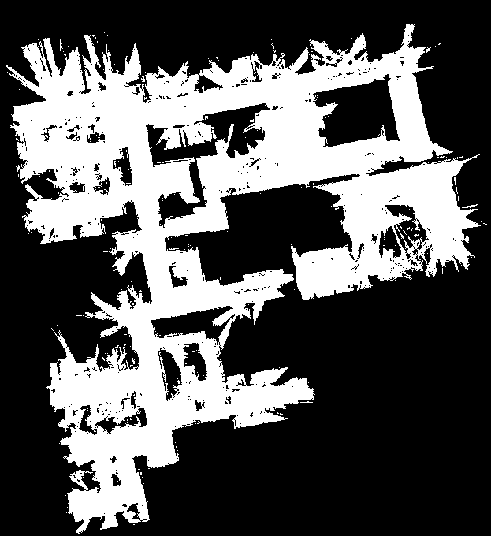
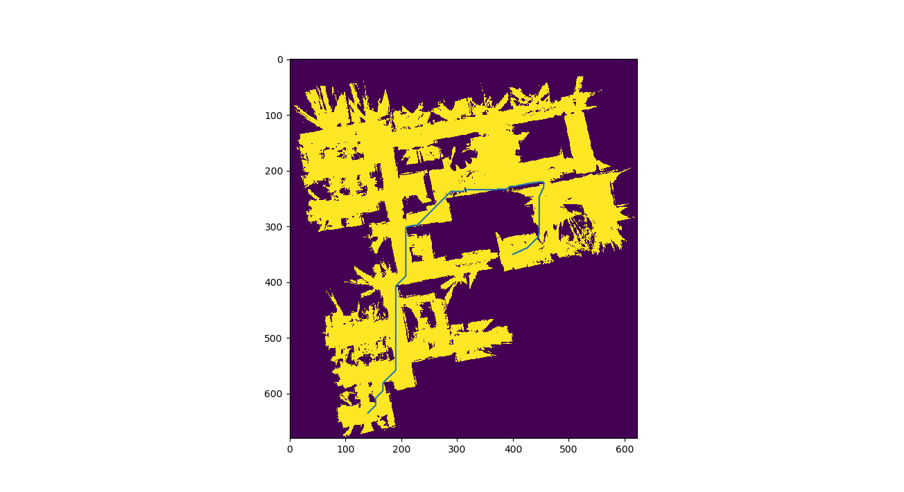
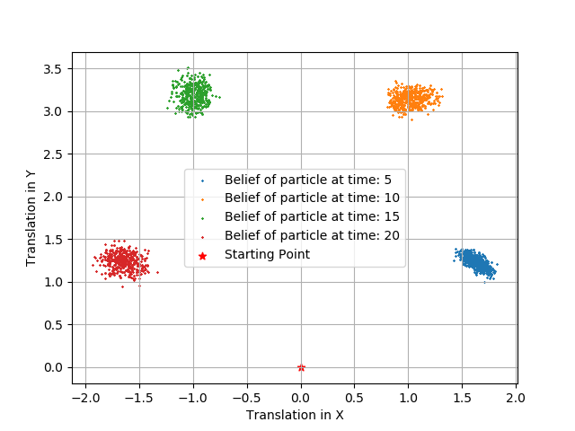

# Mobile-Robotics
This repository comprises my implementations of a selection of algorithms that I have developed during my studies in the EECE5550 Mobile Robotics course.

## Route planning in occupancy grid maps
The figure presented displays an occupancy grid map, which serves as a convenient representation for the robot's environment information and is particularly suitable for route planning algorithms. Within this task, I successfully implemented two graph-based planning algorithms, namely A* search and Probabilistic Roadmap, for the purpose of conducting route planning.

### A* Search output

A* is a well-known algorithm for path planning, employing a heuristic function to navigate the search for a path within the given environment. By evaluating the total cost estimate from the starting point to the goal through each node, A* expands the search tree accordingly. This estimate, referred to as the "heuristic," serves as a guiding factor towards the goal, enabling A* to efficiently discover optimal paths compared to alternative search algorithms. However, A* necessitates prior possession of a comprehensive environment map and can be computationally demanding since it may need to explore a significant portion of the space to find a solution.

### PRM's output

PRM is an algorithm for path planning that utilizes a sampling approach. It constructs a roadmap by identifying the free space within the environment and subsequently utilizes this roadmap to determine a path connecting the starting point and the desired destination. A notable advantage of PRM is its ability to handle environments with intricate or unknown geometry, as it does not necessitate a complete pre-existing map of the environment. Additionally, PRM can promptly discover paths in real-time, as it does not need to search the entire space to find a solution. However, it is worth noting that PRM may occasionally generate suboptimal paths due to its reliance on random sampling and its lack of consideration for specific environment characteristics.

The provided image illustrates all the interconnected nodes resulting from the sampling points, determined by conducting reachability checks.

/PRM_nodes.png)

The final output with sampled points:

/PRM_nodes_&_Optimal_path.png)

## State estimation by (Monte-Carlo) Partile Filter on a Lie Group

In this exercise, I have applied particle filtering to perform state estimation over a Lie group: specifically, designed and implement a particle filter to track the pose of a differential-drive ground robot.

We can write a generative description of the motion model for a a differential drive robot. Suppose the left and right wheel, with $r$ as the wheel radius, $w$ as the track width, true speeds defined as $(\tilde{\varphi}_l, \tilde{\varphi}_r)$ with $commanded$ wheel speeds of $u := (\dot{\varphi}_l,\dot{\varphi}_r)$ has a noise model of:

$\tilde{\varphi}_l = \dot{\varphi}_l + \epsilon_l,\ \ \epsilon_l \sim N(0,\sigma_l^2)$
 
$\tilde{\varphi}_r = \dot{\varphi}_r + \epsilon_r,\ \ \epsilon_r \sim N(0,\sigma_r^2)$

The generative motion model $p(x_{t2} | x_{t1} , \dot{\varphi_l},\dot{\varphi_r}, r, w, \sigma_l, \sigma_r)$ that parameterizes the distribution of the pose of the robot $x_{t2} \in SE(2)$ as a function of the pose $x_{t1} \in SE(2)$ at time $t_2$ is given by the exponential map:

$P(X_0 | X_t, u) = P(X_0)*exp(t * \dot{\Omega}(\dot{\varphi}_l,\dot{\varphi}_r))$

where $\dot{\Omega}$ is an element in the $Lie(SE(2))$ characterized by the wheel speeds $(\dot{\varphi}_l,\dot{\varphi}_r)$

Output by Particle Filter for the time stamps [0,5,10,15,20] with the measurement updates:

## Scan matching using Iterative Closest Point

In this I have implement the Iterative Closest Point (ICP) algorithm, and use it
to estimate the rigid transformation that optimally aligns two 3D pointclouds. The given
two pointclouds $X,Y \subset \mathbb{R}^{d}$ have an initial guess $(t_0,R_0) \in SE(d)$ for the optimal rigid registration $y = R_x + t$ aligning $X$ to $Y$.

Initial guess:

/Separated_point_clouds.PNG)

Aligned point clouds overlayed on the initial guess:

/Corrected_point_clouds.PNG)
 
